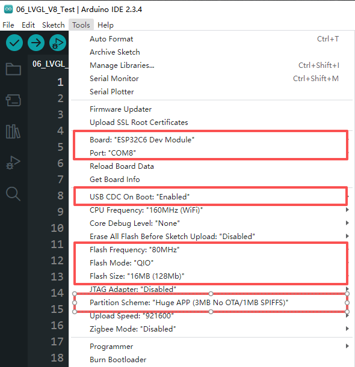

# ESP32-C6-Touch-AMOLED-2.16

[](https://github.com/waveshareteam/ESP32-C6-Touch-AMOLED-2.16/actions/workflows/esp-idf-examples.yml)
[](https://github.com/waveshareteam/ESP32-C6-Touch-AMOLED-2.16/actions/workflows/arduino-examples.yml)

Examples, reusable board components, source firmware, and recovery images for the
Waveshare ESP32-C6-Touch-AMOLED-2.16.

- [English product wiki](https://www.waveshare.com/wiki/ESP32-C6-Touch-AMOLED-2.16)
- [中文产品 Wiki](https://www.waveshare.net/wiki/ESP32-C6-Touch-AMOLED-2.16)

## Repository layout

| Path | Purpose |
| --- | --- |
| `examples/esp-idf/` | First-party ESP-IDF examples |
| `examples/arduino/examples/` | First-party Arduino sketches |
| `examples/arduino/libraries/` | Libraries pinned for the Arduino examples |
| `components/` | Reusable local ESP-IDF components |
| `firmware/xiaozhi/` | Source tree for the XiaoZhi firmware variant |
| `firmware/factory_firmware/` | Prebuilt recovery images |
| `docs/` | Structure, CI, migration, firmware, and validation notes |

See [Project structure](docs/PROJECT_STRUCTURE.md) for ownership boundaries and
[Migration guide](docs/MIGRATION.md) for the old-to-new path map.

## ESP-IDF examples

Each directory in `examples/esp-idf/` is an independent ESP-IDF project:

```sh
cd examples/esp-idf/01_AXP2101_Test
idf.py set-target esp32c6
idf.py build
idf.py flash monitor
```

The CI workflow is the compatibility source of truth and builds every example
against the maintained ESP-IDF 5.5 and 6.0 lines.

## Arduino examples

Open the `.ino` file inside an example directory. Use the ESP32-C6 board profile,
16 MB flash, QIO mode, and the 3 MB application/9 MB FAT partition scheme shown
below. The CI workflow pins the exact Arduino-ESP32 core used for validation.



LVGL 8 and LVGL 9 are intentionally kept in separate directories. Use LVGL 8
only with `08_LVGL_V8_Test`; `07_Audio_Test` and `09_LVGL_V9_Test` use LVGL 9.

## Firmware

Recovery images and the preserved XiaoZhi source snapshot are documented in
[Firmware](firmware/README.md). The contents under `firmware/` are kept as
supplied and are excluded from repository CI. Example workflows still upload
reproducible ZIP bundles with binaries, flash addresses, and flash helpers.

## Contributing

Read [CONTRIBUTING.md](CONTRIBUTING.md) before changing board pins, dependencies,
CI matrices, or release artifacts. Compilation proves software compatibility;
hardware behavior still requires on-device validation.
